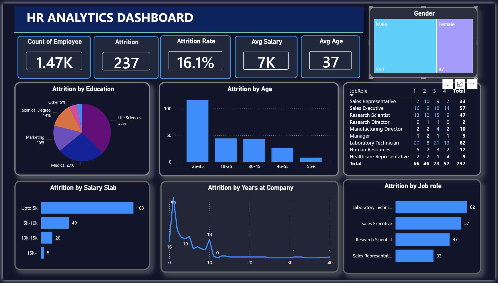

# 📊 HR Analytics Dashboard (Power BI)

---

## 📌 Project Overview
The HR Analytics Dashboard is an interactive data visualization project built using Microsoft Power BI.  
It provides insights into employee demographics, attrition trends, salary distribution, job roles, and workforce patterns to support data-driven HR decision-making.

This dashboard helps organizations:
- Monitor employee attrition and turnover
- Understand workforce demographics
- Identify high-risk employee segments
- Analyze salary and experience trends
- Improve retention strategies

---

## 🎯 Business Objectives
- Analyze employee attrition patterns
- Identify factors contributing to employee turnover
- Track workforce distribution by age, gender, and education
- Evaluate salary impact on attrition
- Understand employee tenure trends

---

## 📊 Key Performance Indicators (KPIs)
- Total Employees: 1.47K
- Attrition Count: 237
- Attrition Rate: 16.1%
- Average Salary: 7K
- Average Age: 37

---

## 📈 Dashboard Components

### Attrition Analysis
- Attrition by Education
- Attrition by Age Group
- Attrition by Salary Slab
- Attrition by Job Role
- Attrition by Years at Company

### Workforce Demographics
- Gender Distribution
- Employee Count Overview
- Average Employee Age

### Job Role Insights
- Attrition across Job Roles
- Role-wise Employee Analysis
- High-risk Job Segments

### Interactive Features
- Data Filtering
- Drill-down Analysis
- Cross-visual Interaction
- Dynamic Visual Reports

---

## 🛠️ Tools & Technologies Used
- Microsoft Power BI Desktop
- Power Query Editor (ETL & Data Cleaning)
- DAX (Data Analysis Expressions)
- Data Modeling
- Interactive Visualizations
- Dashboard Design Techniques

---

## 🧮 DAX & Calculations Used
- Employee Count Measure
- Attrition Count Measure
- Attrition Rate Calculation
- Average Salary Measure
- Average Age Measure
- Role-wise Attrition Metrics

---

## 🗂️ Dataset Requirements

### Employee Information
- Employee ID
- Age
- Gender
- Education Field
- Job Role
- Department

### Employment Details
- Monthly Income / Salary
- Years at Company
- Attrition Status (Yes/No)
- Hiring Date / Experience
- Employment Status

### Optional Recommended Fields
- Performance Rating
- Job Satisfaction Score
- Promotion History
- Overtime Status
- Work-Life Balance
- Environment Satisfaction

---

## ✅ Data Quality Requirements
- Unique Employee IDs
- No Duplicate Records
- Standardized Job Role Names
- Valid Age Values
- Consistent Salary Formats
- Proper Handling of Missing Values
- Accurate Attrition Labels

---

## 📁 Project Structure
HR-Analytics-Dashboard/
│
├── DASHBOARD.png
├── HR_ANALYSTICS.pbix
└── README.md

---

## 📊 Key Insights
- High attrition observed in Laboratory Technician and Sales Executive roles
- Employees in lower salary slabs show higher turnover rates
- Majority attrition occurs within early years at the company
- Mid-age employees show notable attrition trends
- Technical and Life Science education backgrounds have higher attrition

---

## 🧠 Conclusion
The HR Analytics Dashboard provides a clear and comprehensive view of workforce behavior and employee attrition patterns.  
By analyzing demographics, salary distribution, job roles, and employee tenure, organizations can identify potential retention risks and take proactive actions.

This dashboard supports:
- Strategic HR planning
- Workforce optimization
- Employee retention improvements
- Data-driven organizational decisions

Overall, it enables HR professionals to better understand workforce dynamics and implement effective strategies to reduce attrition and enhance employee satisfaction.

---

## 🚀 Future Enhancements
- Predictive Attrition Modeling
- Department-Level Analysis
- Real-Time Data Integration
- Automated Reporting
- Machine Learning-Based Insights
- Advanced KPI Monitoring

---

**👩💻 Created by:** Alfiya Ahmed  
**📅 Date:** February 2026  

